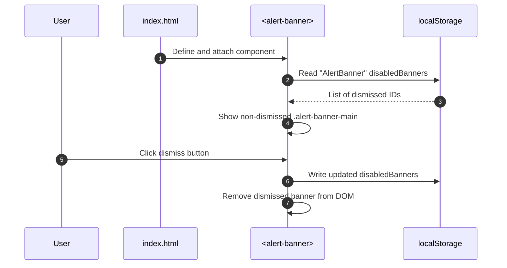
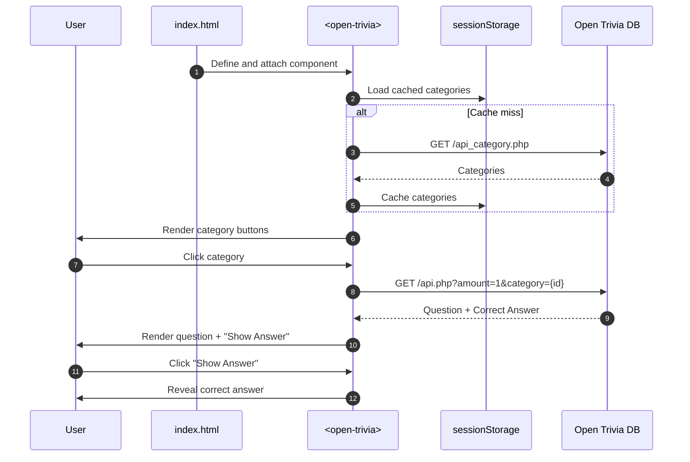

# Storage Directory

This directory contains a demonstration of browser storage APIs (localStorage and sessionStorage) through an interactive Open Trivia application.

## Overview

The storage directory showcases how to use the Web Storage API to persist user preferences and cache data for better user experience. It includes a complete web application that demonstrates both localStorage and sessionStorage usage patterns.

## Files

### HTML

- **`index.html`** - Main application page featuring an alert banner system and Open Trivia game

### JavaScript Components

- **`js/alert-banner.js`** - Custom element that manages dismissible alert banners using localStorage
- **`js/open-trivia.js`** - Custom element for the trivia game that caches categories in sessionStorage

### CSS Styling

- **`css/reset.css`** - Modern CSS reset combining best practices from multiple sources
- **`css/alert-banner.css`** - Styles for the alert banner component
- **`css/open-trivia.css`** - Styles for the trivia game interface

## Features

### Sequence Diagram(s)

### Alert Banner System

- Dismissible notification banners
- Persists dismissed state in localStorage
- Prevents dismissed banners from reappearing on page reload

### Open Trivia Game

- Fetches trivia categories from Open Trivia Database API
- Caches categories in sessionStorage for faster subsequent loads
- Interactive category selection and question display
- Automatic category re-enabling after question selection

### Storage Usage

- **localStorage**: Persists user preferences (dismissed banners) across browser sessions
- **sessionStorage**: Caches API data (trivia categories) for current session only

## Technical Details

- Built with vanilla JavaScript using Web Components
- Responsive design with modern CSS
- Error handling for storage operations and API calls
- Accessibility considerations (ARIA labels, keyboard navigation)

## Usage

Open `index.html` in a web browser to see the storage APIs in action. The application will automatically demonstrate localStorage persistence and sessionStorage caching behavior.
